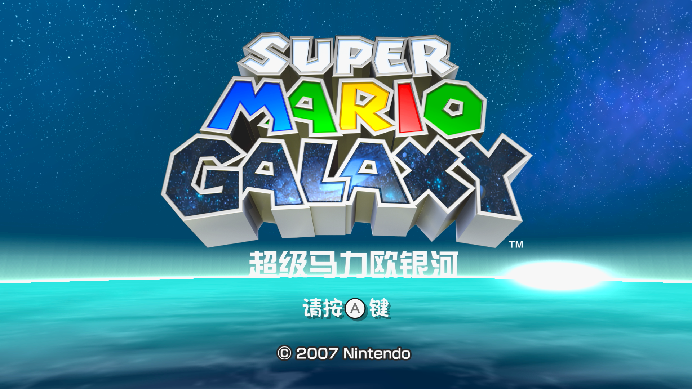
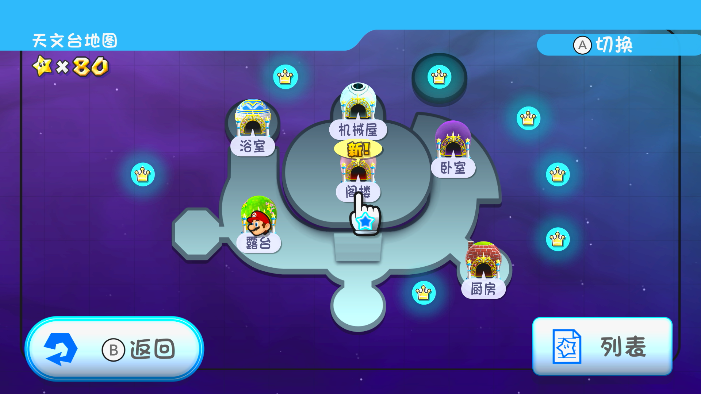

# 《超级马力欧银河》（Switch 版）汉化

## 基本说明

本项目是对《超级马力欧 3D 收藏辑》中收录的《超级马力欧银河》的简体中文本地化。

中文文本基本来源于中国大陆发行的 Nvidia Shield TV 版《超级马力欧银河》，部分新增文本重新进行了翻译。由于技术限制，暂时没有采用任天堂最新译名（例如，桃花公主 → 碧姬公主）。

如需转载，请保留此说明。

## 使用方式

需要一台能够运行 [Atmosphere](https://github.com/Atmosphere-NX/Atmosphere) 自制固件（CFW）的 Nintendo Switch 主机。请下载补丁并解压，然后将 `010049900f546003` 文件夹移动到到 `SD:/atmosphere/contents/` 文件夹下。如果没有这个文件夹，请手动创建。

补丁压缩包下载地址：

- GitHub：<https://github.com/Qi-Busiyi-Hanhuazu/SMGSwitchChsLocalization/releases/download/v1.0.0/SMGSwitchChsLocalization.v1.0.0.zip>
- 百度网盘：<https://pan.baidu.com/s/1UUnXXwEMRAGTBoZBkF6QZA?pwd=smga>

## 截图预览

  

## 授权协议

`scripts/bmg.py` 文件来自于 [ndspy](https://github.com/RoadrunnerWMC/ndspy)，对字节序相关的处理进行了修改，此文件按照 [GPL-3.0](LICENSE.ndspy.txt) 授权。

其他构建脚本使用 **[CC BY-NC-SA 4.0](https://creativecommons.org/licenses/by-nc-sa/4.0/legalcode)** 协议授权。若您想基于本项目进行二次创作，请遵守协议内容。这些内容主要包括：

- **署名**：您必须标明本项目的作者，并在您的作品中提供指向本项目的链接。
- **非商业性使用**：您不得将本项目用于商业目的。
- **相同方式共享**：若您基于本项目进行二次创作，您必须以相同的协议授权您的作品。

请阅读本项目的 **[完整授权协议](LICENSE.txt)** 以了解更多信息。
